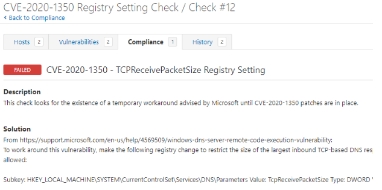
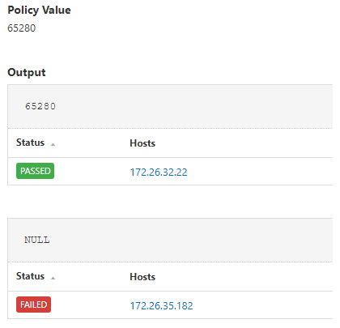

# CVE-2020-1350
Recently a flaw was discovered in Windows DNS services, https://www.tenable.com/blog/cve-2020-1350-wormable-remote-code-execution-vulnerability-in-windows-dns-server-sigred. As part of a stopgap measure until systems can be patched, Microsoft released a recommended registry key change.

Tenable audits can be used to check for the existence of this specific key and value.

## Audit information

Let's break down the audit and examine each section.

1. This conditional uses PowerShell to verify if the ‘dns’ service is found.
```
<if>
  <condition type:"AND">
    <custom_item>
      type            : AUDIT_POWERSHELL
      description     : "Check for the DNS service"
      value_type      : POLICY_TEXT
      value_data      : "Pass"
      powershell_args : "$service=$(get-service | where {$_.Name -like 'dns'}); if($service) { $result='Pass' } else { $result='Fail'}; $result"
    </custom_item>
  </condition>
```
2. If the conditional is true, execute the <then></then> block. The Windows compliance plugin reads registry DWORD values as the binary equivalent, and in this case 0xFF00 is 65280. This is also seen when entering the value in the registry

```
<then>
    <custom_item>
      type        : REGISTRY_SETTING
      description : "CVE-2020-1350 - TCPReceivePacketSize Registry Setting"
      <content snipped for brevity>
      value_type  : POLICY_DWORD
      value_data  : 65280
      reg_key     : "HKLM\SYSTEM\CurrentControlSet\Services\DNS\Parameters"
      reg_item    : "TCPReceivePacketSize"
      reg_option  : CAN_NOT_BE_NULL
    </custom_item>
</then>
```
3. If the conditional is false, execute the <else></else> block. This will return a PASSED report stating the service was not found. If it is desired to not have this report and return nothing, the entire <else></else> section can be deleted.
```
<else>
  <report type: "PASSED">
    description : "CVE-2020-1350 - TCPReceivePacketSize Registry Setting"
    info        : "The Windows DNS service was not found. This check is not applicable."
  </report>
</else>
</if>
```

The full audit will produce the following results when scanned against targets:


In this example, two hosts were scanned, one that is compliant with the setting and a second that is not.

